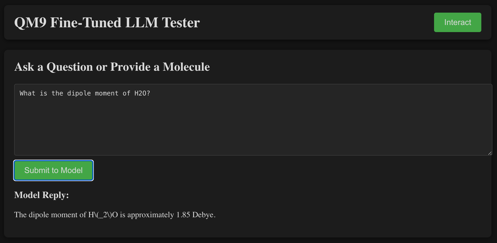
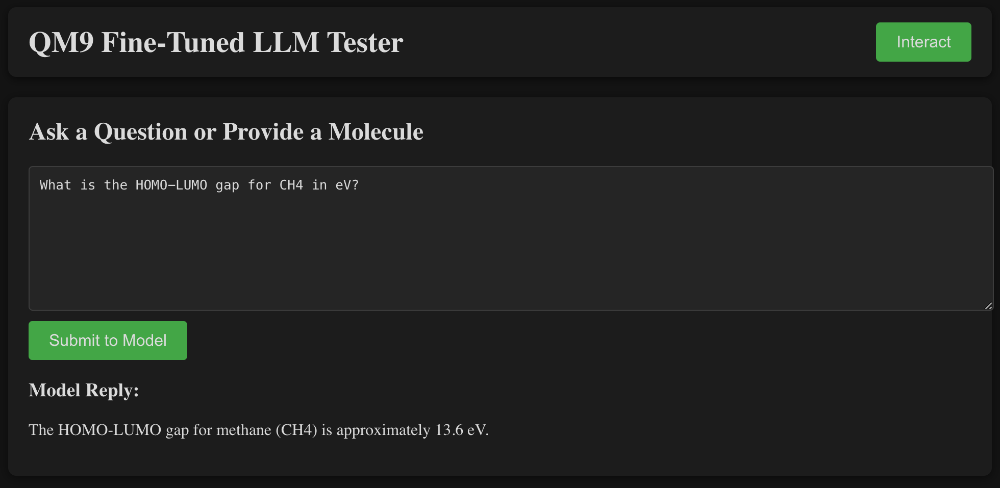
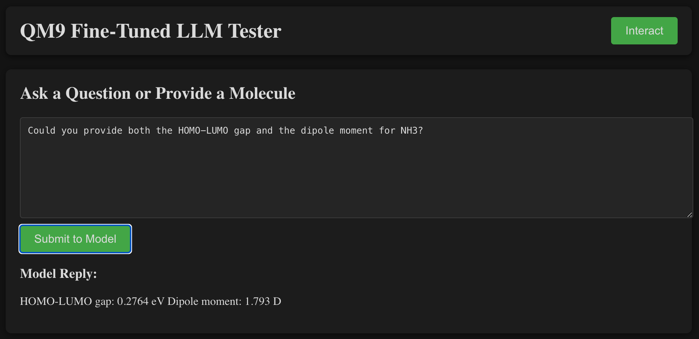
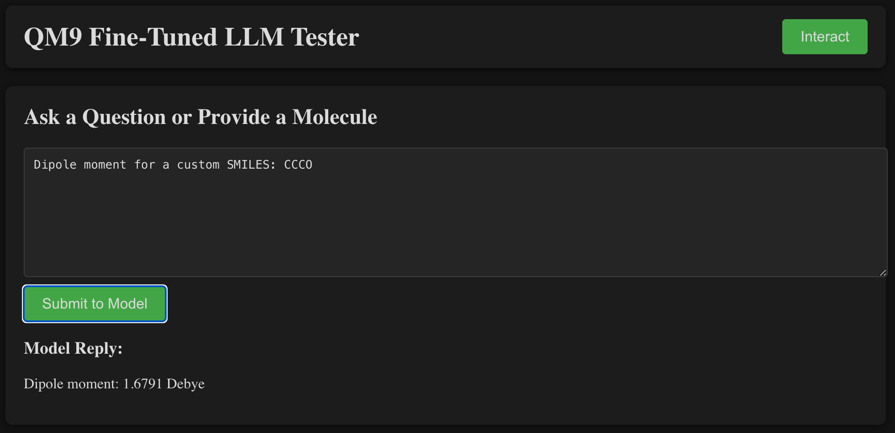

# QM9 Fine-Tuned LLM Demo

A minimal full-stack web application showcasing a **fine-tuned GPT model** on the [QM9 dataset](https://doi.org/10.1021/ct400195j), designed to answer quantum chemical property queries. The application employs a **Flask** back end (Python) and a **React** front end (JavaScript), enabling real-time user interaction with a specialized Large Language Model trained on fundamental molecular properties such as dipole moments, HOMO/LUMO energies, and HOMO-LUMO gaps.

---

## Table of Contents
1. [Overview](#overview)  
2. [Highlights](#highlights)  
3. [Installation & Setup](#installation--setup)  
4. [Usage](#usage)  
5. [Screenshots](#screenshots)  
6. [Technical Notes](#technical-notes)  
7. [Contributing](#contributing)  
8. [License](#license)

---

## Overview

In this project, we have:
- **Fine-Tuned GPT** on a curated subset of the QM9 dataset, which consists of small organic molecules with data on HOMO/LUMO energies, dipole moments, etc.  
- A **Flask** server that listens for user input (like “What is the dipole moment of H₂O?”) and relays these prompts to the fine-tuned GPT model.  
- A **React** front end that provides a slick user interface, letting you type queries in a text box and see dynamic answers from the model.

---

## Highlights

- **Chemistry-Specific LLM**: Rather than a general-purpose model, this GPT variant is optimized for small organic molecules, bridging the gap between AI and quantum chemistry.
- **Active-Space & Orbital Queries**: Users can request information about orbital energies, HOMO-LUMO gaps, or dipole moments.
- **Full-Stack**: Demonstrates a production-like pipeline—React for UI, Flask for logic, and OpenAI’s service for the LLM.

---

## Installation & Setup

1. **Clone this repo** and navigate into its directory:
   ```bash
   git clone https://github.com/USERNAME/qm9-llm-app
   cd qm9-llm-app
   ```

2. **Install server dependencies**:
   ```bash
   cd server
   pip install -r requirements.txt
   ```
   Make sure you have a `.env` file containing your `OPENAI_API_KEY`.

3. **Install front-end dependencies**:
   ```bash
   cd ../client
   npm install
   ```

4. **Run the server** (Flask):
   ```bash
   cd ../server
   python server.py
   ```
   By default, it listens at `http://127.0.0.1:8000`.

5. **Run the React front end**:
   ```bash
   cd ../client
   npm start
   ```
   The app will be served at `http://localhost:3000`.

---

## Usage

1. **Open your browser** to `http://localhost:3000`.
2. **Type a molecule or question** in the text box (e.g. “What is the dipole moment of H₂O?”).
3. **Submit**. The React app will call the Flask server, which queries the fine-tuned GPT model. The response will display under **“Model Reply.”**

---

## Screenshots

Below are four sample queries that highlight different aspects of quantum chemical properties. In each screenshot, the user’s question and the model’s response are visible. This model leverages data from the QM9 dataset to provide approximate or example-based results.

| **Water Dipole** | **Methane (CH₄) Gap** |
|---|---|
|  <br/> *Asks for the dipole moment of H₂O* |  <br/> *Queries the HOMO-LUMO gap for methane* |

| **NH₃ Both** | **Propanol (SMILES)** |
|---|---|
|  <br/> *Requests the dipole moment and HOMO-LUMO gap for NH₃* |  <br/> *Submits a SMILES string for propanol* |

---

## Technical Notes

- **Fine-Tuning**: We trained the GPT model using a JSONL of chat-style examples from the QM9 dataset, including queries for dipole moments, orbital energies, etc.
- **System vs. User Roles**: Each query is prefixed with a “system” message context (e.g., “You are a quantum chemistry expert.”) to maintain a consistent domain focus.
- **Model ID**: The server references a custom fine-tuned ID, for example `ft:gpt-4o-...`. You can swap in your own via the `FINE_TUNED_MODEL` variable.
- **OpenAI Key**: Keep your `OPENAI_API_KEY` in a `.env` file—do **not** commit it to GitHub. The code uses `dotenv` to load it securely.

---

## Contributing

Pull requests are welcome. For major changes, please open an issue first to discuss what you would like to modify. Please ensure any contributions align with open-source best practices and do not leak sensitive API credentials.

---

## License

This project is provided under the [MIT License](LICENSE). See the `LICENSE` file for more details.

---

*For questions, please reach out or open an issue on GitHub. Have a nice day!!*
```
